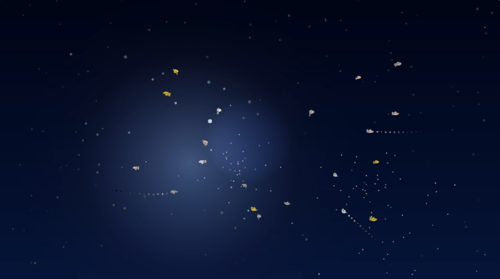

# Ocean Aura（海洋之息）

一个基于 Python + OpenCV + MediaPipe 的互动艺术作品，营造深海梦幻氛围。

## 演示视频


## 演示截图



## 目录

- [演示视频](#演示视频)
- [演示截图](#演示截图)
- [项目主题](#项目主题)
- [功能特性](#功能特性)
- [技术栈](#技术栈)
- [安装方式](#安装方式)
- [运行方式](#运行方式)
- [交互方式](#交互方式)
- [项目结构](#项目结构)
- [开发说明](#开发说明)
- [贡献指南](#贡献指南)
- [许可证](#许可证)
- [Credits](#credits)

## 项目主题

Ocean Aura 是一个沉浸式的互动艺术装置，模拟深海中的生物荧光世界。当你的手进入画面时，就像潜入深海，唤醒周围的海洋生命。

### 视觉风格

- **深海** - 深蓝渐变背景，营造海底氛围
- **梦幻** - 柔和的发光粒子和鱼群
- **治愈** - 缓慢的呼吸感和自然的运动
- **发光** - 生物荧光效果，不刺眼
- **艺术装置风** - 简洁优雅，无游戏UI

## 功能特性

### 1. 深海背景
- 深蓝渐变背景，从顶部到底部逐渐变暗
- 海水散射光效果，模拟光线穿透水面
- 整体呼吸感，亮度缓慢变化
- 暗角效果（Vignette），聚焦视线

### 2. 发光粒子系统
- 约155个发光粒子，分为前景、中景、后景三层
- 模拟海洋浮游生物或星光
- 默认状态缓慢随机漂浮，轻微闪烁
- 靠近手的粒子被"唤醒"，亮度提高、速度加快
- 粒子围绕手缓慢旋转，形成不规则发光区域

### 3. 环绕光斑
- 25个小光斑围绕手旋转
- 各自独立的轨道和速度
- 轻微闪烁效果，像星星点缀

### 4. 鱼群系统
- 20条鱼围绕手形成圆形区域游动
- 每条鱼有独立的角度、速度、轨道半径
- 鱼身根据运动方向旋转，尾巴轻微摆动
- 3条星光鱼会留下发光尾迹
- 4条消散鱼淡出时会产生白色光点

### 5. 握拳释放星光（互动）
- 握拳手势触发星光释放
- 每次生成40~60个星光粒子
- 粒子轨迹分为三类：
  - 70% 扩散型：缓慢向外扩散并下沉
  - 20% 停留型：停留在手边缓慢闪烁
  - 10% 远飘型：飘得更远更亮
- 粒子逐渐变小、变透明，自然消失
- 颜色丰富：冰蓝、青蓝、白色、淡青色、淡紫色，偶尔金色/粉紫色点缀

### 6. 全局洋流（Global Ocean Current）
- 整个场景存在一个低强度的二维流场
- 漂浮粒子、星光粒子、鱼都会受到流场影响
- 流场方向每8~15秒缓慢变化，使用线性插值平滑过渡
- 影响系数：漂浮粒子0.15，星光粒子0.10，鱼0.05
- 所有对象在保持各自运动规律的同时，产生轻微一致性的偏移

### 7. 沉浸式音频系统
- 深海环境音持续循环播放
- 握拳时触发星光音效
- 鱼群出现时触发气泡音效

## 技术栈

- Python 3.8+
- OpenCV (cv2) - 图像渲染
- MediaPipe - 手部检测和手势识别
- NumPy - 数值计算

## 安装方式

### 使用 pip（推荐）

```bash
pip install ocean-aura
```

### 从源码安装

```bash
git clone https://github.com/yujiaxueredaiyu/fish3.git
cd fish3
pip install -e .
```

### 直接安装依赖

```bash
pip install opencv-python>=4.8.0 mediapipe>=0.10.0 numpy>=1.24.0
```

## 运行方式

### 方式一：命令行工具

```bash
ocean-aura
```

### 方式二：Python 模块

```bash
python -m ocean_aura
```

### 方式三：直接运行

```bash
python src/ocean_aura/main.py
```

## 交互方式

### 基本交互
- **手进入画面** - 唤醒周围粒子，鱼群聚集过来
- **手移动** - 粒子和鱼群缓慢跟随
- **手离开画面** - 粒子恢复漂浮状态，鱼群逐渐散开消失

### 高级交互
- **握拳** - 从掌心释放一片星光粒子
- **松开再握拳** - 再次释放星光

### 退出方式
- 按 `Q` 键退出
- 按 `ESC` 键退出
- 点击窗口关闭按钮退出

## 项目结构

```
Ocean Aura/
├── src/
│   └── ocean_aura/
│       ├── __init__.py          # 包初始化，导出公共API
│       ├── __main__.py          # 模块入口
│       ├── audio.py             # 音频系统
│       ├── config.py            # 配置参数管理
│       ├── fish.py              # 鱼群系统
│       ├── flow_field.py        # 全局流场系统
│       ├── hand_detection.py    # 手部检测
│       ├── main.py              # 主应用类
│       ├── particles.py         # 粒子系统
│       └── visualization.py     # 可视化渲染
├── tests/                       # 测试目录
├── assets/                      # 音频资源
│   ├── samuelfjohanns-atmosphere-of-atlantis-246389.wav  # 深海环境音
│   ├── djartmusic-christmas-sparkle-whoosh_1-275404.wav  # 星光音效
│   └── krnbeatz-bubble-in-water-422579.wav               # 气泡音效
├── .github/
│   └── workflows/
│       └── ci.yml               # 持续集成配置
├── .gitignore                   # Git忽略规则
├── CODE_OF_CONDUCT.md           # 行为准则
├── CONTRIBUTING.md              # 贡献指南
├── LICENSE                      # MIT许可证
├── README.md                    # 项目说明
├── demo3.mp4                    # 演示视频
├── demo_screenshot.png          # 演示截图
├── pyproject.toml               # 项目配置
└── requirements.txt             # 依赖列表
```

## 开发说明

### 模块说明

| 模块 | 说明 | 主要类 |
|------|------|--------|
| `audio.py` | 音频播放管理 | `AudioSystem` |
| `config.py` | 全局参数配置 | 配置常量 |
| `fish.py` | 鱼群行为逻辑 | `Fish` |
| `flow_field.py` | 全局流场系统 | `FlowField` |
| `hand_detection.py` | 手部追踪检测 | `HandDetector` |
| `main.py` | 主应用程序 | `OceanAura`, `main()` |
| `particles.py` | 粒子效果系统 | `Particle`, `StarParticle` |
| `visualization.py` | 背景渲染 | `OceanVisualizer` |

### 配置参数

所有配置参数集中在 `config.py` 中：

- `PARTICLE_CONFIG` - 粒子系统参数
- `FLOW_FIELD_CONFIG` - 全局洋流参数
- `FISH_CONFIG` - 鱼群系统参数
- `SPARKLE_CONFIG` - 光斑系统参数
- `STAR_PARTICLE_CONFIG` - 星光粒子参数
- `AUDIO_CONFIG` - 音频系统参数
- `VISUAL_CONFIG` - 视觉效果参数

### 运行测试

```bash
python -m pytest tests/
```

### 代码格式化

```bash
black src/
isort src/
```

## 贡献指南

欢迎贡献代码！请阅读 [CONTRIBUTING.md](CONTRIBUTING.md) 了解详细信息。

## 许可证

MIT License - 详见 [LICENSE](LICENSE)

## Credits

### Author
- **yujiaxueredaiyu** - [GitHub](https://github.com/yujiaxueredaiyu)

### Audio Assets
- **Ambient Sound**: "Atmosphere of Atlantis" by Samuel F Johanns
- **Starlight Effect**: "Christmas Sparkle Whoosh" by DJ Artmusic  
- **Bubble Effect**: "Bubble in Water" by Krn Beatz
- **Source**: [Pixabay](https://pixabay.com/)
- **License**: Pixabay Content License

### Third-Party Libraries
| Library | Purpose | License |
|---------|---------|---------|
| OpenCV | Computer Vision | Apache 2.0 |
| MediaPipe | Hand Tracking | Apache 2.0 |
| NumPy | Numerical Computing | BSD-3-Clause |

### Model
- **Hand Landmarker**: MediaPipe Hand Tracking Model
- **Source**: Google MediaPipe
- **License**: Apache 2.0

### Team
- **yujiaxueredaiyu** - 独立开发者，负责项目整体设计与开发

---

This project uses free audio resources provided under the Pixabay Content License.
